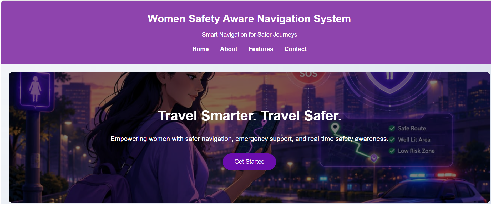
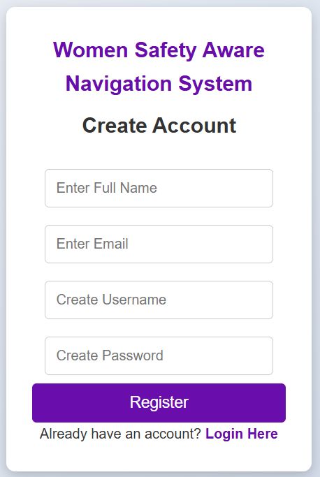
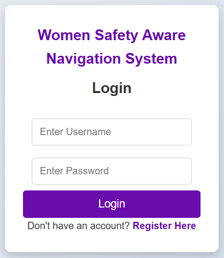
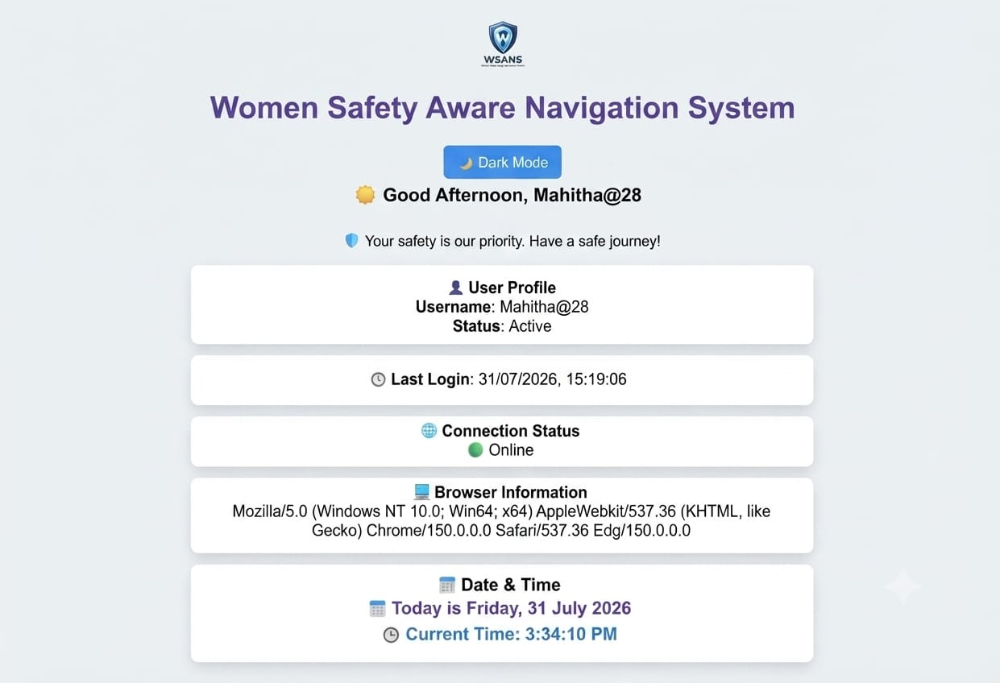
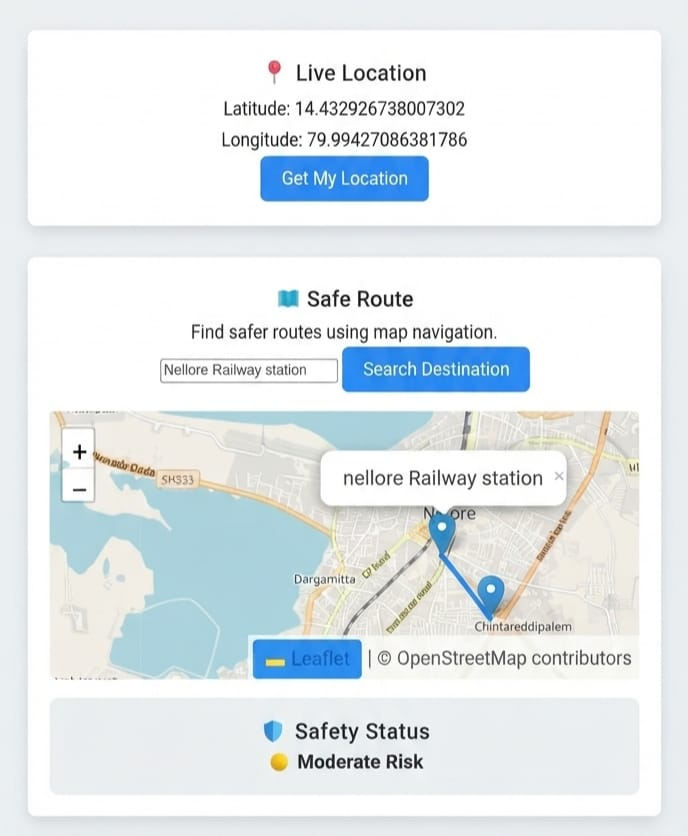
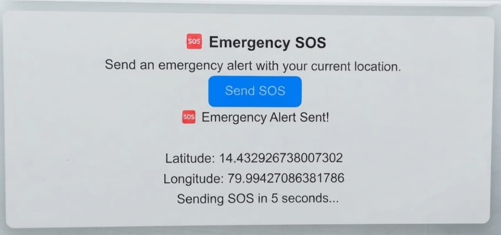
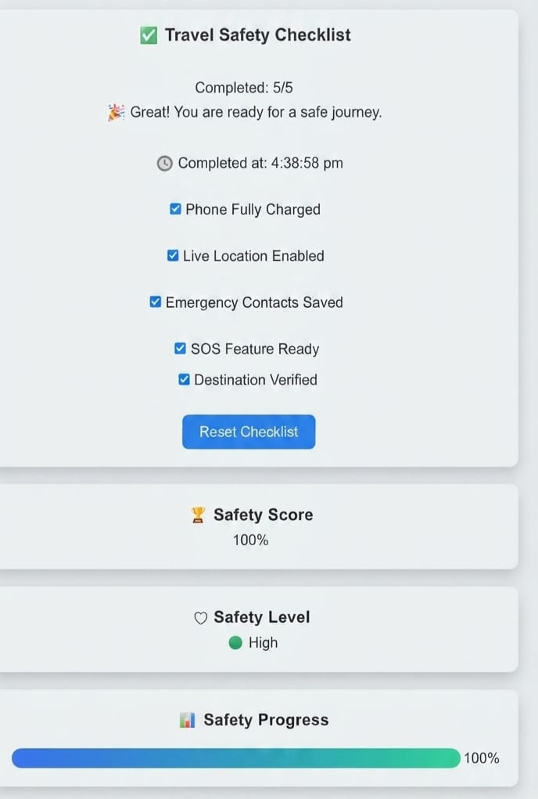

# Women Safety Aware Navigation System

### 🚀 Live Demo
Access the live application here: [Women Safety Aware Navigation System](https://mahithapathipati.github.io/Women-Safety-Aware-Navigation-System/)

## Tech Stack
* **HTML**
* **CSS**
* **JavaScript**

## Project Overview

The Women Safety Aware Navigation System is a smart web application that helps women travel safely by providing secure route suggestions, real-time location tracking, emergency SOS alerts, and safety-focused navigation.
## Project Features

- User Registration and Login
- Personalized Dashboard
- Real-time Location Detection
- Destination Search
- Safety Risk Indicators
- Emergency SOS Alert
- Safety Tips and Quiz
- Safety Checklist
- Dark Mode Support
- Online/Offline Status Detection

## Technologies Used

### Frontend
- HTML
- CSS
- JavaScript

### Libraries
- Leaflet.js
- OpenStreetMap

### Storage
- Browser LocalStorage

## Project Workflow

1. User registers an account.
2. User logs into the system.
3. Dashboard provides safety features.
4. User shares current location.
5. User searches destination.
6. System displays safety level.
7. User can activate SOS during emergencies.

## Future Enhancements

- Real-time crime data integration
- AI-based safe route prediction
- Emergency contact notification system
- Live weather API integration

## Project Screenshots

### Home Page

### Registration Page

### Login Page

### Dashboard

### Map

### SOS Feature

### Safety Checklist

